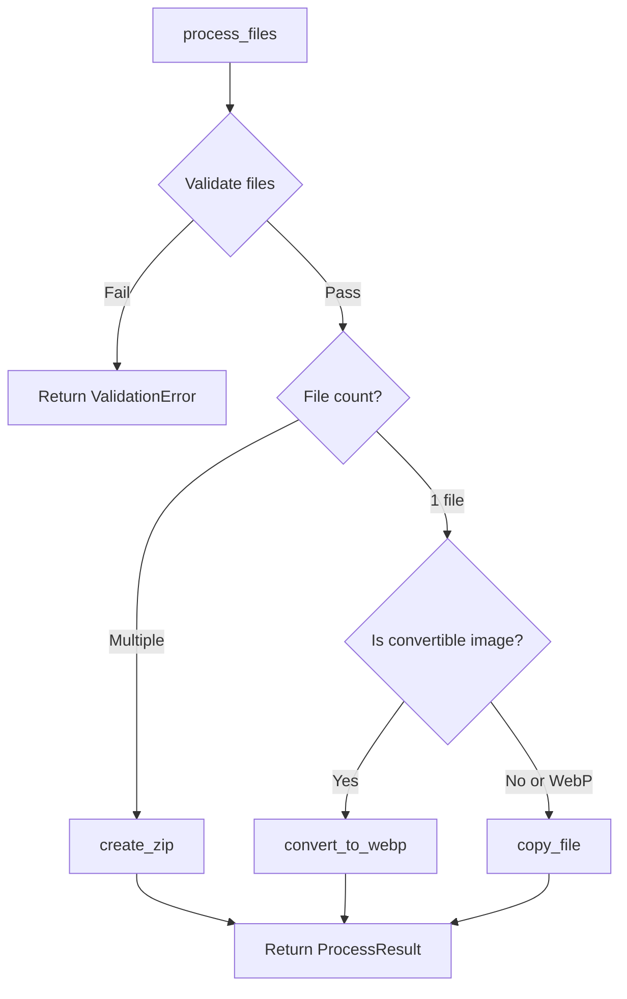

The file processing module (`processor.rs`) handles file validation, image conversion to WebP format, and ZIP archive creation.

## Constants

### Validation Limits

```rust
pub const MAX_FILES: usize = 50;
pub const MAX_SINGLE_FILE_SIZE: u64 = 500 * 1024 * 1024; // 500MB
pub const MAX_TOTAL_SIZE: u64 = 1024 * 1024 * 1024; // 1GB
```

### Allowed File Extensions

The processor supports the following file types:
- **Images**: jpg, jpeg, png, gif, bmp, tiff, tif, webp, heic, heif, svg, ico, raw, cr2, nef, arw
- **Documents**: pdf, doc, docx, xls, xlsx, ppt, pptx, txt, rtf, csv, md, markdown, pages, numbers, key
- **Archives**: zip, tar, gz, 7z, rar, bz2, xz, tgz
- **Video**: mov, mp4, avi, mkv, webm, m4v, wmv, flv, 3gp
- **Audio**: mp3, wav, aac, flac, m4a, ogg, wma, aiff
- **Code & Data**: json, xml, html, css, js, ts, jsx, tsx, py, rs, go, swift, java, c, cpp, h, rb, php, sh, bash, zsh, yaml, yml, toml, ini, sql, graphql
- **macOS/Apps**: dmg, pkg, app, ipa
- **Fonts**: ttf, otf, woff, woff2, eot
- **Other**: log, env, gitignore, dockerfile

## Data Structures

### ProcessResult

Returned by all processing functions to indicate the result of file processing.

<ParamField path="output_path" type="PathBuf" required>
  Path to the processed output file
</ParamField>

<ParamField path="original_size" type="u64" required>
  Total size of input file(s) in bytes
</ParamField>

<ParamField path="processed_size" type="u64" required>
  Size of output file in bytes (after compression/conversion)
</ParamField>

<ParamField path="file_type" type="String" required>
  Output file extension ("webp", "zip", or original extension)
</ParamField>

### ValidationError

Error type returned when file validation fails.

<ParamField path="message" type="String" required>
  Human-readable error message
</ParamField>

<ParamField path="file" type="Option<String>">
  Optional path to the file that caused the error
</ParamField>

## Functions

### validate_files

Validates files before processing to ensure they meet size and type requirements.

```rust
pub fn validate_files(paths: &[PathBuf]) -> Result<(), ValidationError>
```

<ParamField path="paths" type="&[PathBuf]" required>
  Array of file paths to validate
</ParamField>

**Returns**: `Result<(), ValidationError>`

**Validation Checks**:
1. At least one file is provided
2. No more than `MAX_FILES` (50) files
3. Each file exists and is not a directory
4. Each file is under `MAX_SINGLE_FILE_SIZE` (500MB)
5. Total size is under `MAX_TOTAL_SIZE` (1GB)
6. File extensions are in the allowed list (if extension present)

**Error Examples**:

<CodeGroup>
```rust No files
ValidationError {
    message: "No files provided",
    file: None
}
```

```rust Too many files
ValidationError {
    message: "Too many files. Maximum is 50 files.",
    file: None
}
```

```rust File too large
ValidationError {
    message: "\"large_video.mp4\" is too large (750.0 MB). Maximum file size is 500 MB.",
    file: Some("/path/to/large_video.mp4")
}
```

```rust Unsupported type
ValidationError {
    message: "Unsupported file type: .xyz (file.xyz)",
    file: Some("/path/to/file.xyz")
}
```
</CodeGroup>

### convert_to_webp

Converts image files (jpg, jpeg, png, gif, bmp, tiff, tif) to WebP format at 80% quality.

```rust
pub fn convert_to_webp(input_path: &Path, output_dir: &Path) -> Result<ProcessResult, String>
```

<ParamField path="input_path" type="&Path" required>
  Path to the input image file
</ParamField>

<ParamField path="output_dir" type="&Path" required>
  Directory where the WebP file will be saved
</ParamField>

**Returns**: `Result<ProcessResult, String>`

**Behavior**:
- Generates unique filename: `{stem}_{8-char-uuid}.webp`
- Uses 80% quality WebP compression
- Preserves original filename stem
- Returns original and processed file sizes

**Example Output**:
```rust
ProcessResult {
    output_path: "/tmp/zipdrop/photo_a1b2c3d4.webp",
    original_size: 2_500_000,
    processed_size: 850_000,
    file_type: "webp"
}
```

### create_zip

Creates a ZIP archive from multiple files using Deflate compression.

```rust
pub fn create_zip(input_paths: &[PathBuf], output_dir: &Path) -> Result<ProcessResult, String>
```

<ParamField path="input_paths" type="&[PathBuf]" required>
  Array of file paths to include in the archive
</ParamField>

<ParamField path="output_dir" type="&Path" required>
  Directory where the ZIP file will be saved
</ParamField>

**Returns**: `Result<ProcessResult, String>`

**Behavior**:
- Generates unique filename: `archive_{8-char-uuid}.zip`
- Uses Deflate compression method
- Preserves original filenames inside the archive
- Calculates total original size of all input files

**Example Output**:
```rust
ProcessResult {
    output_path: "/tmp/zipdrop/archive_x7y8z9w0.zip",
    original_size: 5_000_000,
    processed_size: 4_200_000,
    file_type: "zip"
}
```

### process_files

Main processing function that applies the ZipDrop logic based on file count and type.

```rust
pub fn process_files(paths: Vec<PathBuf>, output_dir: &Path) -> Result<ProcessResult, String>
```

<ParamField path="paths" type="Vec<PathBuf>" required>
  Vector of file paths to process
</ParamField>

<ParamField path="output_dir" type="&Path" required>
  Directory where processed files will be saved
</ParamField>

**Returns**: `Result<ProcessResult, String>`

**Processing Logic**:

<Expandable title="Single File">
  - **Convertible image** (jpg, jpeg, png, gif, bmp, tiff, tif): Converts to WebP
  - **Already WebP**: Copies file with unique name
  - **Non-image**: Copies file with unique name
</Expandable>

<Expandable title="Multiple Files">
  - Creates ZIP archive containing all files
</Expandable>

**Flow Diagram**:



**Example Usage**:

<CodeGroup>
```rust Single Image
let paths = vec![PathBuf::from("/path/to/photo.jpg")];
let output_dir = Path::new("/tmp/zipdrop");
let result = process_files(paths, output_dir)?;
// Result: photo_a1b2c3d4.webp
```

```rust Multiple Files
let paths = vec![
    PathBuf::from("/path/to/doc.pdf"),
    PathBuf::from("/path/to/photo.jpg"),
];
let output_dir = Path::new("/tmp/zipdrop");
let result = process_files(paths, output_dir)?;
// Result: archive_x7y8z9w0.zip
```

```rust Single PDF
let paths = vec![PathBuf::from("/path/to/document.pdf")];
let output_dir = Path::new("/tmp/zipdrop");
let result = process_files(paths, output_dir)?;
// Result: document_b2c3d4e5.pdf (passthrough)
```
</CodeGroup>

## Error Handling

All functions return `Result` types with descriptive error messages:

- **File I/O errors**: "Failed to read file metadata", "Failed to create output file"
- **Image processing errors**: "Failed to open image", "Failed to write WebP"
- **ZIP errors**: "Failed to create zip file", "Failed to write to zip"
- **Validation errors**: See `ValidationError` examples above

<Note>
  Files without extensions are allowed and will be treated as binary files. The output will preserve the filename with a unique ID suffix.
</Note>